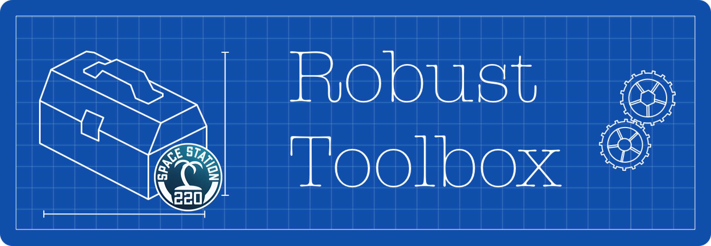

Robust Toolbox is an engine primarily being developed for [Space Station 14](https://github.com/space-wizards/space-station-14) by Space Wizards.

This repository is a fork of the Robust Toolbox engine, created by the SS220 team for use in SS220 projects.
If you seek original repository, then [just click here](https://github.com/space-wizards/RobustToolbox).

Current list of projects that depend on this fork changes:
- [SS220 | Space Station 14](https://github.com/SerbiaStrong-220/space-station-14)
- [SS220 | Exodus: Monolith](https://github.com/SerbiaStrong-220/Monolith)

## Project Links

### SS220 Links

[Discord](https://discord.gg/ss220) | [Documentation](https://serbiastrong-220.github.io/docs)

### Space Wizards Links

[Website](https://spacestation14.io/) | [Discord](https://discord.gg/t2jac3p) | [Forum](https://forum.spacestation14.io/) | [Steam](https://store.steampowered.com/app/1255460/Space_Station_14/) | [Standalone Download](https://spacestation14.io/about/nightlies/) | [Documentation](https://docs.spacestation14.io/)

## Fork Features

We decided not to separate our versions from the upstream and maintain them in parallel.
This is because this fork of the engine is not only used for one project, and our different projects may require a different upstream version,
so we maintain our versions for each upstream version that we need at the moment.

This fork isn't supposed to be used for projects not related to SS220, but we also maintain our [release notes](RELEASE-NOTES-220.md)

## Contributing

We recommend you to contribute to the (original repository)[https://github.com/space-wizards/RobustToolbox] instead of creating PRs for us.

But if you really want to work with us we recommend you to achive us in Discord first or at least create a Github issue (but we dont check them often).

## Building

This repository is the **engine** part of SS14. It's the base engine all SS14 servers will be built on. As such, it does not start on its own: it needs the [content repo](https://github.com/space-wizards/space-station-14). Think of Robust Toolbox as BYOND in the context of Space Station 13.

## Legal Info

See [legal.md](https://github.com/SerbiaStrong-220/RobustToolbox/blob/master/legal.md) for licenses and copyright.
